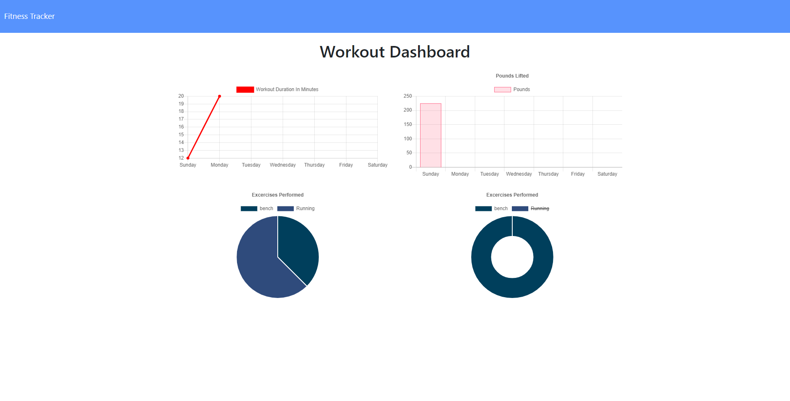
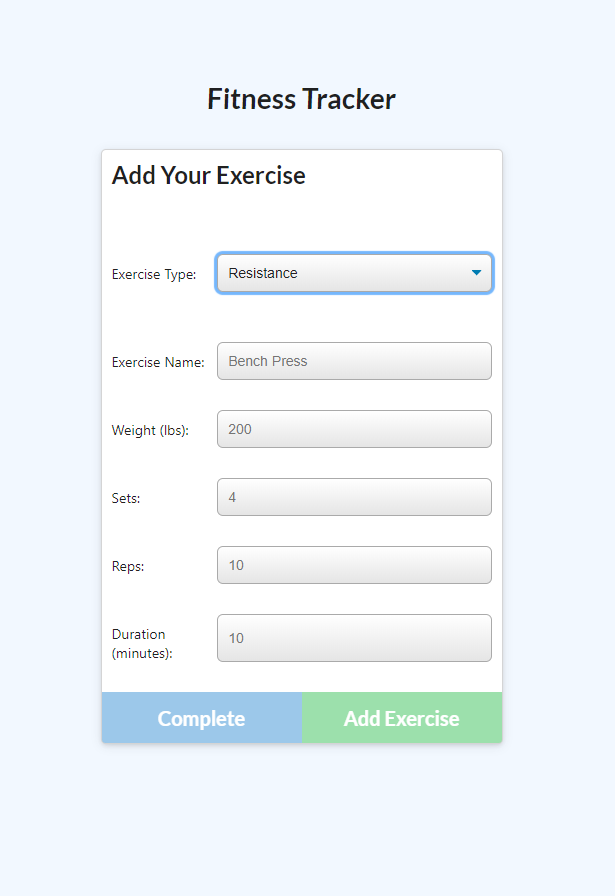

# Fitness Tracker
  
## Languages
&ensp;&ensp;&ensp;&ensp;&ensp;
## Description
Fitness tracker allows you to create a workout and add as many exercises to your workout as you want. Fitness Tracker also includes a dashboard where you can view your workout stats.

## Table of Contents
* [Installation](#Installation)
* [Usage](#Usage)
* [Contributing](#Contributing)
* [License](#License)
* [Languages](#Languages)
* [Contact](#Contact)

## Installation
Run npm install when you first open the root directory. Do not run the seed file.

## Usage
The creates a workout and then adds exercises to the workout. When the user is finished with their workout they can navigate to the Fitness Tracker Dashboard where they can view stats from their workout.

## License
MIT

## Contributing
Clone the repository and submit a pull request.

## Contact
Forrest Miller

[Click here to visit my website](http://www.forrestmillerdesign.com/)
